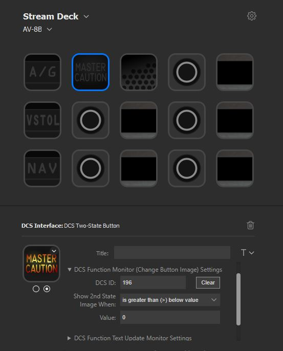

# streamdeck-dcs-interface

**NOTE: Work in Progress**

`DCS Interface` is a plugin for the Streamdeck that allows communication with DCS via lua UDP sockets for both receiving udpates of the simulation state as well as sending commands to interact with the clickable cockpits.

# Description

`DCS Interface` is a plugin that allows you to create buttons and interfaces that update with DCS events.
There are currently three settings for each Streamdeck button you create:  
 - DCS Command - Specify which button/switch you want to activate in game (similar to setting keybindings in game).
 - DCS Function Monitor - Specify a function within the DCS simulation to monitor and change the display to the alternate image when value is either >, ==, or < a specified value.
   - Examples: Lamps for Warnings/Modes, Switch states
 - DCS Function Text Update - Specify a function in the DCS simulation which outputs a text string you want the Streamdeck button title to display.
   - Examples: UFC text displays, scratchpads, radio displays

More detailed instructions can be found in the [Help Documentation](Sources/com.ctytler.dcs.sdPlugin/helpDocs/helpContents.md).

### Demo of Operation:

### Example of Settings to Display Master Caution Lamp:

# Installation

In the Release folder, you can find the file `com.ctytler.dcs.streamDeckPlugin`. If you double-click this file on your machine, Stream Deck will install the plugin.

WIP: Will add DCS export instructions.

# Source code

The Sources folder contains the source code of the plugin. The primary components are as follows:  
 - `Sources/MyStreamDeckPlugin.{cpp,h}` - StreamDeck C++ API (based on the Elgato streamdeck-cpu example)
 - `Sources/StreamdeckContext.{cpp,h}` - Class which stores each visible Streamdeck button's settings
 - `Sources/DcsInterface.{cpp,h}` - Interface between plugin and DCS
 - `Sources/DcsInterfaceParams.h` - Defines the UDP ports to communicate with DCS
 - `Sources/com.ctytler.dcs.sdPlugin/proprtyinspector` - Contains html and javascript for handling user settings
The Stream Deck plugin details are modified via `Sources/com.ctytler.dcs.sdPlugin/manifest.json`.

# Build from source instructions
A build script is included which will build both the C++ executable which handles the communcation with DCS as well as the package for the Stream Deck plugin: `build_plugin.bat`  

You must call this file from the [Developer Command Prompt for VS](https://docs.microsoft.com/en-us/dotnet/framework/tools/developer-command-prompt-for-vs) in order for the Visual C++ target build step to work.

You may also need to install the Boost C++ library as it is used by the base Streamdeck SDK.
