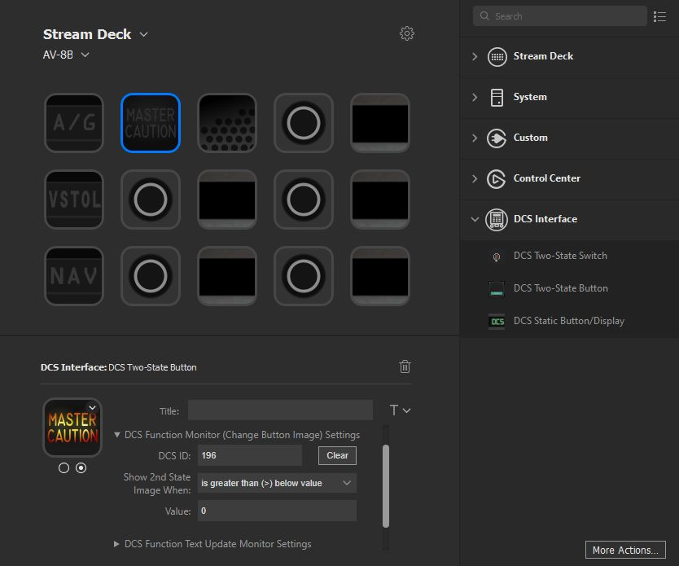

`DCS Interface` is a plugin for the Streamdeck that allows communication with DCS via lua UDP sockets for both receiving updates of the simulation state as well as sending commands to interact with the clickable cockpits.

- [Description](#description)
  - [Detailed Documentation](#detailed-documentation)
- [Demo of Operation](#demo-of-operation)
- [Installation](#installation)
    - [Downloads](#downloads)
    - [Version Update](#version-update)
      - [Identify installed version number:](#identify-installed-version-number)
    - [Initial Configuration](#initial-configuration)
    - [Video Walkthrough](#video-walkthrough)
- [Source code](#source-code)
- [Build from source instructions](#build-from-source-instructions)

# Description

`DCS Interface` is a plugin that allows you to create buttons and interfaces that update with DCS events.
There are currently three settings for each Streamdeck button you create:

- DCS Command - Specify which button/switch you want to activate in game (allows setting of any clickable object in a cockpit).
  - Streamdeck buttons support push-button, switch, and increment (dials, levers, etc.) input types.
- Image Change Settings - Specify a function within the DCS simulation to monitor and change the display of the Streamdeck image conditionally.
  - Examples: Lamps for Warnings/Modes, Switch states
- Title Text Change Settings - Specify a function in the DCS simulation which will be monitored and its text is displayed as the Streamdeck button Title.
  - Examples: UFC text displays, scratchpads, radio displays

Can also support multiple physical Streamdecks at once.

## Detailed Documentation

More detailed instructions can be found in: [Settings Help Documentation](Sources/com.ctytler.dcs.sdPlugin/helpDocs/helpContents.md).

---

# Demo of Operation


**Example of Settings to Display Master Caution Lamp:**



# Installation

### Downloads

- For the DCS plugin to work you will first need [DCS-ExportScripts](https://github.com/asherao/DCS-ExportScripts) installed, detailed instructions are on their [Wiki](https://github.com/s-d-a/DCS-ExportScripts/wiki). This is the backend that is relied on for communication with the DCS game.

- To install the DCS Interface Streamdeck plugin, you will need to download and run the installer `com.ctytler.dcs.streamDeckPlugin` from [Releases](https://github.com/charlestytler/streamdeck-dcs-interface/releases).

- Also within [Releases](https://github.com/charlestytler/streamdeck-dcs-interface/releases) is an optional `icon_library.zip` you can download for use with Streamdeck Profiles.

### Version Update

If you have a prior version already installed on your StreamDeck, you will have to uninstall it first before installing the latest version. To do this right-click on one of the DCS Interface button types in the right-side panel and click "Uninstall".

#### Identify installed version number:
To see the version of the plugin installed on the StreamDeck, right-click on one of the DCS Interface button types in the right-side panel.

### Initial Configuration

If you plan to only use DCS Interface for Streamdeck with the DCS-ExportScript and not [Ikarus](https://github.com/s-d-a/Ikarus), you can modify the file `DCS-ExportScript\Config.lua` to have the following settings (where `IkarusPort` is changed from `1625` to `1725` for DCS Interface) to get everything connected:

```
-- Ikarus a Glass Cockpit Software
ExportScript.Config.IkarusExport    = true         -- false for not use
ExportScript.Config.IkarusHost      = "127.0.0.1"  -- IP for Ikarus
ExportScript.Config.IkarusPort      = 1725         -- Port Ikarus (1625)
ExportScript.Config.IkarusSeparator = ":"
```

If you are interested in using the export script to support both Streamdeck and Ikarus, instructions can be found in the [Settings Help Documentation - Enabling Both DCS Interface & Ikarus](Sources/com.ctytler.dcs.sdPlugin/helpDocs/helpContents.md#enabling-both-dcs-interface--ikarus).

### Video Walkthrough

A walkthrough of installation and configuration can be found at the below link, along with other instructional videos.  
[DCS Interface for Streamdeck Video Instructions](https://www.youtube.com/playlist?list=PLcYO7a2ywThz7nIT4CjRTn737ZM26aqDq)

# Source code

The Sources folder contains the source code of the plugin. The primary components are as follows:

```
Sources
├── DcsInterface              Classes for interacting with DCS
├── ElgatoSD                  Elgato Streamdeck SDK source and utilities
├── StreamdeckContext         Classes for maintaining state of individual Streamdeck buttons
│   ├── ExportMonitors        Classes that monitor DCS export state for individual buttons
│   ├── SendActions           Classes that define button press and release actions
├── StreamdeckInterface       Executable that interfaces C++ code with Streamdeck plugin
├── Test                      Unit test infrastructure and target
├── Utilities                 Generic utilities for UDP socket and string manipulation
├── Vendor                    Third party source code
├── Windows                   Visual Studio solution settings
└── com.ctytler.dcs.sdPlugin  Plugin package containing javascript and compiled C++ executable
    ├── manifest.json         Definition of Streamdeck plugin metadata
    ├── bin                   Location for compiled C++ and lua scripts called by plugin
    ├── helpDocs              Help documentation within plugin
    ├── images                Default icon images
    └── propertyinspector     Javascript and html used by plugin (Button settings and windows)
```

# Build from source instructions

A build script is included which will build both the C++ executable which handles the communcation with DCS as well as the package for the Stream Deck plugin: `Tools/build_plugin.bat`

You must call this file from the [Developer Command Prompt for VS](https://docs.microsoft.com/en-us/dotnet/framework/tools/developer-command-prompt-for-vs) in order for the Visual C++ target build step to work.

Current version was built with Visual Studio Community 2019.
