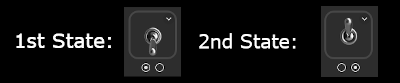
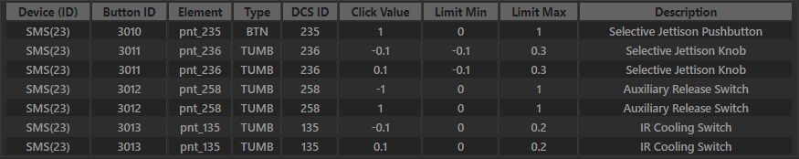
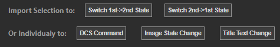
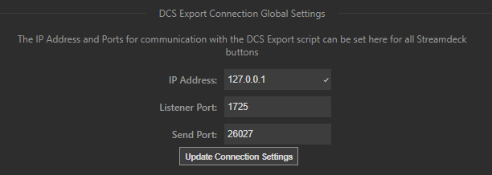
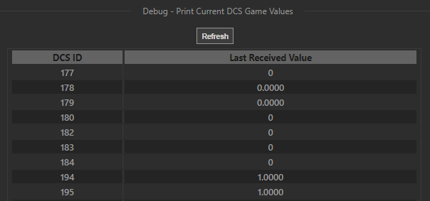

# DCS Interface Streamdeck Plugin

##### _Developed by Charles Tytler, 2020._

- [Description of Streamdeck Button Settings](#description-of-streamdeck-button-settings)
  - [DCS Command (on Button Press) Settings](#dcs-command-on-button-press-settings)
    - [Momentary Button settings](#momentary-button-settings)
    - [Increment Settings](#increment-settings)
    - [Switch Settings](#switch-settings)
  - [Image State Change on DCS Update Settings](#image-state-change-on-dcs-update-settings)
  - [Title Text Change on DCS Update Settings](#title-text-change-on-dcs-update-settings)
- [ID Lookup Window](#id-lookup-window)
  - [Setup Required - DCS Install Directory](#setup-required---dcs-install-directory)
  - [Aircraft Module Clickabledata](#aircraft-module-clickabledata)
  - [Search Function](#search-function)
  - [Select and Import to Settings](#select-and-import-to-settings)
- [DCS Comms Window](#dcs-comms-window)
  - [IP Configuration Settings](#ip-configuration-settings)
  - [Test Connection / Debug Received DCS ID Values](#test-connection--debug-received-dcs-id-values)
- [Additional Information](#additional-information)
  - [Enabling Both DCS Interface & Ikarus](#enabling-both-dcs-interface--ikarus)
  - [Manually Determining Clickabledata Attributes](#manually-determining-clickabledata-attributes)

<br/>

# Description of Streamdeck Button Settings

In order to use the DCS Interface buttons on Streamdeck you must use ID values that the aircraft modules use internally via their .lua scripts.

---

## DCS Command (on Button Press) Settings

These set what will be commanded to DCS when you physically press the StreamDeck button.

**Button ID** -- The Button ID is a number associated with the specific clickabledata item (button, switch, dial, lever) you would like to command.

**Device ID** -- The Device ID is a number representing different categorizations of clickable items in the cockpit. The definition of the number is defined in:

The remaining settings differ according to what type of DCS Interface button is used and can be categorized into Momentary, Increment, and Switch.

### Momentary Button settings

The momentary buttons are used to send commands to clickabledata items of BTN type, or LEV type in special cases, see note below.

**Send Value while Pressed** -- This is the value that is sent immediately upon pressing the Streamdeck button. By default most buttons will use `1` for a pressed value. Sometimes pairs of buttons (such as up/down arrow buttons on a panel) will have `1` as the pressed value for the up arrow button, and `-1` as the value for the down arrow button, even though they are independent buttons.

**Send Value while Released** -- This is the value that is sent after releasing the Streamdeck button. For most momentary buttons (such as a numeric UFC button) will remain pressed until they are sent an off value, (by default) `0`.

**Disable (Send Release) Check** -- The checkbox next to the "Send Value while Released" will disable any command being sent when releasing a button.

_Note: Repetition of sent value while button is held pressed is not supported at this time._

**Use with Axis (LEV) Type** -- Some of the radio frequency and comms channel selectors are designed to accept axis input, and they expect a single value to increment their value. For example a volume knob with limits 0,1 can be rotated with small rotations by setting "Send Value while Pressed" to `0.01` and disabling the release value (as the release value will just interfere). To rotate a greater amount per press, increase the send value.

### Increment Settings

Increment buttons are used for clickabledata items of TUMB type, which are rotary dials or other items that have multiple values you want to iterate through.

**DCS ID** -- This is the ID of the clickabledata item's value you want to increment. This is separate from the Button ID, and provides information on the DCS simulation state of the item. The value is used to increment from the simulation state value so button presses don't get out of sync with the game and dials can be rotated by either clicking in the cockpit or using the Streamdeck button.

**Increment by Value** -- This is the amount you would like to increment by. A common value used by most rotary switches in the game is `0.1` where a positive value rotates in the clock-wise direction and a negative value, `-0.1`, will rotate counter-clock-wise. Increasing this value will allow larger increments per button press.

**Increment range min/max** -- These values represent the range limits for the clickabledata item. By default this will limit inputs from the "Increment by Value" such that the min/max is not exceeded. Generally the range is often `[0,1]`, but for rotary selector switches with discrete values (such as L/R/BOTH) it is common to set each of those settings to a 0.1 multiple and adjust the range accordingly. So a switch with three options would have a range `[0.0,2.0]` where `(0.0, 0.1, 0.2)` would correspond to the three options. Similarly, items with an implied direction may have a negative component with a range like `[-0.1,0.1]`.

**Allow cycling to beginning** -- This checkbox when checked allows an increment to cycle back to the beginning of a range. If the increment is positive, exceeding the max value would reset the value to the min, and vice versa for a negative increment.

### Switch Settings

The switch can also be used with clickabledata items of TUMB type, but is used in the case where there are two values you want to switch between and uses the Streamdeck image state to manage its state.



**Send Value for 1st->2nd State** -- This is the value sent when the Streamdeck button is in the 1st state and you want to transition to the 2nd state. The Streamdeck button image state will only change if the DCS simulation DCS ID which the image is monitoring changes.

**Send Value for 2nd->1st State** -- This is the value sent when the Streamdeck button is in the 2nd state and you want to transition back to the 1st state.

Switch commands must be used in conjunction with the "Image State Change on DCS Update Settings" to actuate the switch state. See section below for details.

---

## Image State Change on DCS Update Settings

These settings will monitor the DCS game and change the image of the Streamdeck button when conditions are met.

")

**DCS ID** -- This field is set to the numeric value of the DCS function you would like to monitor. For switches or physical button states the DCS ID from the ID Lookup table can be used here, but lamps and other indicator values will need to be looked up externally.

As this Streamdeck plugin relies on the **DCS-ExportScript** project for communication with the game, I recommend finding lamp and indicator values directly from their curated export scripts - [GitHub Link](https://github.com/s-d-a/DCS-ExportScripts/tree/master/Scripts/DCS-ExportScript/ExportsModules).

For example the AV8B Harrier A/G Mode indicator lamp has a DCS ID of `281` as seen from the comments (anything prepended with "--") in the following excerpt of **DCS-ExportScript**'s `AV8BNA.lua` file:

```
    --MIP OUTER LEFT SIDE
    [283] = "%.f", --NAV
    [285] = "%.f", --VSTOL
    [281] = "%.f", --A/G
```

**Show 2nd State Image When** -- This setting is a selection of how you would like to evaluate the received state of the function (`<`, `==`, or `>`). If the evaluation is `True`, then the state of the button will be set to the 2nd state (the illuminated button if looking at the above image).

Example: `DCS ID = 281, Show When = ">", Value = 0.0`  
For these settings the second state of the button will be activated (showing the second image) if the A/G Mode lamp function returns a value of `1.0`, and will reset to the first state if it drops back to `0.0`.

**Value** -- This is the value of the condition evaluated with either `<`, `==`, or `>`. This is generally a numeric value.

---

## Title Text Change on DCS Update Settings

This section is to monitor the same type of DCS functions as the "Image State Change" section above, but instead of changing the Streamdeck button image it will set the button's Title text. Examples of where this would be useful is for Aircraft Scratchpads and UFC Text Displays, and with additional configuration rotary switch selected values.

**DCS ID** -- This field is set to the numeric value of the DCS function you would like to monitor. ID values here can be determined here in the same manner as done for the "Image State Change" as described above.

For example, with the `AV8BNA.lua` export script, setting a DCS ID equal to `250` would display the text for the ODU Option1 panel.

```
    -- ODU Panel
    [250] = "%1d", --ODU Option1
    [251] = "%1d", --ODU Option2
    [252] = "%1d", --ODU Option3
    [248] = "%1d", --ODU Option4
    [249] = "%1d", --ODU Option5
```

**Vertical Spacing** -- This provides an option for shifting the displayed text up (positive values) or down (negative values) a number of lines. By default this is set to 0. This can be used in combination with the Vertical Alignment settings in the Streamdeck Title settings (i.e. shift up or down from Center alignment, or shift down from Top alignment).

**Display string unaltered** -- By default this is checked and will set the title text to exactly what is received for the monitored DCS ID. This is desired for handling functions with text values, such as the ODU text display panel used in the example above. If this is unchecked an additional settings textbox is provided, "Map Value to Display Text."

**Map Value to Display Text** -- This box allows mapping numeric values received from the simulation to displayed text. An example use case is for showing the selection of a rotary switch. For example the F-5E module has an "External Stores Selector" dial which selects between (RIPL,BOMBS,SAFE,RKT/DISP) using internal values of (0.0, 0.1, 0.2, 0.3). Monitoring the DCS ID for this clickabledata item will return the numeric value. If you would like to display the text equivalents of those values you can uncheck "Display string unaltered" and in the map value textbox enter (without spaces):

```
0.0=RIPL,0.1=BOMBS,0.2=SAFE,0.3=RKT/DISP
```

**Text/Font Settings** -- The font, size, vertical alignment, and color of the text can be set with the Streamdeck Title (T) settings.

**NOTE:** The "Title" field must be left empty in the Streamdeck settings for this to work.

---

# ID Lookup Window

## Setup Required - DCS Install Directory

The ID lookup uses a lua script to extract clickabledata item attributes from the modules in the DCS World installation. Therefore, the directory where DCS World is installed must be entered correctly in the textbox - use the "Update" button to save changes.

If the directory is not specified correctly the "Select Module" drop-down will be blank. When the install directory is found, modules installed within `<DCS World install dir>\mods\aircraft\` directory will be included in the Select Module list.

## Aircraft Module Clickabledata

When a module is selected from the drop-down list the table of clickabledata will be populated. Each row represents a registered "clickable" cockpit item in the game. Some elements have more than one row, this often corresponds to the different actions taken for a mouse "left-click" and "right-click" on that item. For example, the "Knob" and "Switch" items below allow rotating clock-wise or counter-clock-wise, for the knob, or moving in the up or down directions, for the switches, so these have a row each with a positive and negative "Click Value".



_Device ID_ -- Shows the name of the device with the Device ID number in parentheses.  
_Button ID_ -- The button ID for the element.  
_Element_ -- Name of the element, only shown for descriptive purposes.  
_Type_ -- Type of the clickabledata item.

- BTN: A push-button, generally with an on/off value aligning with the Limit Min/Max (can be positive or negative).
- TUMB: A switch or dial with multiple values that can be assigned within the Limit Min/Max range.
- LEV: An axis-assignable item that can generally accept a value within a continuous range of the Limit Min/Max.

_DCS ID_ -- The ID to monitor the value of the item, needed for Increment and Switch Streamdeck buttons.  
_Click Value_ -- The value sent for a left/right click of the mouse. May have different meaning according to Type:

- BTN: Click value is generally the "pressed" button value (usually 1).
- TUMB (Rotary Knobs): This is the value the knob will be incremented within the range (usually +/-0.1).
- TUMB (Switches): This is the value the switch will be incremented within the range on click (usually +/-1, but sometimes +/-0.1 also).
- LEV: Click value is the increment value within the range, however is often listed as 0 in the table. For these you will need to manually enter a Send value in Command settings that provides a desirable response. (Note: depending on the item you will need either an increment type to vary the values sent, or a momentary button with the "Send on Release" disabled to provide a constant increase/decrease value).

_Limit Min_ -- The minimum value the item can be commanded to.  
 _Limit Max_ -- The maximum value the item can be commanded to.  
 _Description_ -- A description of item use as defined by the "Hint" field of clickabledata.lua definition.

## Search Function

The clickabledata table can be searched by typing a query in the "Search" field at the top-right of the table.

## Select and Import to Settings



The ID Lookup window also provides Import Settings buttons for convenience. The buttons will extract clickabledata item attributes and set the following settings according to the button pressed:

- **Switch 1st->2nd State**
  - Sets the _Button ID_, _Device ID_, and _Send Value for 1st->2nd State_ settings for the "DCS Command" settings.
  - Also sets the _DCS ID_ for the "Image State Change" settings (leaves condition-value to "> 0" default)
- **Switch 2nd->1st State**
  - Sets the _Button ID_, _Device ID_, and _Send Value for 2nd->1st State_ settings for the "DCS Command" settings.
  - Also sets the _DCS ID_ for the "Image State Change" settings (leaves condition-value to "> 0" default)
- **DCS Command**
  - Sets the _Button ID_, _Device ID_, and _Send Value while Pressed_ settings (leaves "Send Value while Released" at "0" default)
- **Image State Change**
  - Sets the _DCS ID_ for the "Image State Change" settings (leaves condition-value to "> 0" default)
- **Title Text Change**
  - Sets the _DCS ID_ for the "Title Text Change" settings

Importing to multiple sections using more than one button is supported.

---

# DCS Comms Window

## IP Configuration Settings

The IP Address, Listener Port, and Send Port can all be configured in this window.



By default LocalHost (127.0.0.1) is used for communicating with the DCS simulation running on the same computer.

The ports used must align with the settings of the [DCS-ExportScript installed](https://github.com/s-d-a/DCS-ExportScripts/tree/master/Scripts/DCS-ExportScript/ExportsModules) according to the path specified in  
`Saved Games\<DCS World>\Scripts\export.lua`

The file `DCS-ExportScript\Config.lua` should have the following settings for the simplest installation:

```
-- Ikarus a Glass Cockpit Software
ExportScript.Config.IkarusExport    = true         -- false for not use
ExportScript.Config.IkarusHost      = "127.0.0.1"  -- IP for Ikarus
ExportScript.Config.IkarusPort      = 1725         -- Port Ikarus (1625)
ExportScript.Config.IkarusSeparator = ":"
```

Note that the **IkarusPort** value has been changed to `1725` to align with DCS Interface's default. This overrides communication with Ikarus, if you would like to run DCS Interface and Ikarus at the same time see [Enabling Both DCS Interface & Ikarus](#enabling-both-dcs-interface--ikarus).

## Test Connection / Debug Received DCS ID Values

This section provides an area to test the connection with DCS and see the contents of the most recently received values for debugging.

The connection is only established once a DCS mission is running. If there is no connection, or if the DCS-ExportScript used to communicate with DCS does not have a .lua export script for the module being used, then a "DCS module not detected" message will be shown.



Clicking the "Refresh" button will show the most recently received values for all exported DCS ID values.

<br/>

---

# Additional Information

## Enabling Both DCS Interface & Ikarus

The default installation instructions suggest overriding the Ikarus port for simplicity and is designed for users not also using Ikarus.

[Ikarus](https://github.com/s-d-a/Ikarus) provides a virtual cockpit display that can display gauges, indicators, and switches that can be displayed in an independent window (or overlaid) from DCS. It also supports touch screen monitors.

To enable use of both the IkarusPort settings should be kept at their default (1625), and a new block of config settings should be added so the file `DCS-ExportScript\Config.lua` contains:

```
-- Ikarus a Glass Cockpit Software
ExportScript.Config.IkarusExport    = true         -- false for not use
ExportScript.Config.IkarusHost      = "127.0.0.1"  -- IP for Ikarus
ExportScript.Config.IkarusPort      = 1625         -- Port Ikarus (1625)
ExportScript.Config.IkarusSeparator = ":"

-- Added for Streamdeck DCS Interface (IkarusExport must also be true)
ExportScript.Config.StreamdeckExport  = true         -- false for not use
ExportScript.Config.StreamdeckHost    = "127.0.0.1"  -- IP for DCS Interface
ExportScript.Config.StreamdeckPort    = 1725         -- Port DCS Interface (1725)
```

Then within the `DCS-ExportScript\lib\Tools.lua` file, find the first line of the below section, and copy paste the "Added section for DCS Interface" block of code below it, so the file contains:

```
        	try(ExportScript.UDPsender:sendto(lPacket, ExportScript.Config.IkarusHost, ExportScript.Config.IkarusPort))

        	-- Added section for DCS Interface ------------
        	if ExportScript.Config.StreamdeckExport then
        		try(ExportScript.UDPsender:sendto(lPacket, ExportScript.Config.StreamdeckHost, ExportScript.Config.StreamdeckPort))
        	end
        	-- End of Added Section -----------------------
```

## Manually Determining Clickabledata Attributes

The clickabledata for each DCS module is extracted from the DCS installation and shown in the "ID Lookup" window. However, if there are problems or you'd like to look at the source of information for more details, here is a description of how to manually identify the values.

### Button ID

The Button ID is referred to as a "command" in the module configuration and can be found in the file:

`Mods\aircraft\<AC_NAME>\Cockpit\[Scripts\]clickabledata.lua`

For example, within AV8BNA the A/G Master Mode button uses `msc_commands.AG_Selector` as its command:

```
elements["PTN_280"] = default_button(_("AG Master Mode Selector"),
    devices.MSC, msc_commands.AG_Selector, 280)
```

The details of the `default_button()` function parameters can be found within `clickable_defs.lua`. Within the file `command_defs.lua` in the same directory as the clickabledata lua script you'll find the following numeric definition of that command:

```
-- AV-/B N/A Commands
start_command   = 3000

msc_commands =
{
	NAV_Selector          = start_command + 282;
	VSTOL_Selector        = start_command + 284;
	AG_Selector           = start_command + 280;
	Switch_SEAT_ADJ       = start_command + 502;
	Seat_SFTY_LVR		  = start_command + 800;
}
```

So from this it can be seen that AG_Selector has a Button ID of (3000 + 280) = `3280`.

### Device ID

The Device ID is a number representing different categorizations of clickable items in the cockpit. The definition of the number is defined in:

`Mods\aircraft\<AC_NAME>\Cockpit\[Scripts\]devices.lua`

For the example of the A/G Master Mode button for AV8B above, the device is defined as `"MSC"`. You will need to then reference the `devices.lua` file to see that the Device ID number is `12` from this line:

```
devices["MSC"]     = counter() -- 12
```

_Note: The `"--"` indicate comments, the true value is defined by the number of `counter()` calls._

### Send Value while Pressed

This value is sent for the Button ID when the Streamdeck button is pressed. For the example we have of our A/G Master Mode button we can see it is defined via the `default_button()` function.

If we now look inside the `clickable_defs.lua` file we can see that the function is defined with the following inputs:

```
function default_button(hint_,device_,command_,arg_,arg_val_,arg_lim_)

    local   arg_val_ = arg_val_ or 1
    local   arg_lim_ = arg_lim_ or {0,1}
```

The `arg_` input is what we already saw and named the Button ID, however this shows that when `arg_val_` and `arg_lim_` are not provided in the `default_button()` function they take on default values of `1` and `{0,1}`, respectively.

The `arg_val_` is what we care about here as that is the value that is sent when the button is pressed.

### Send Value while Released

This value is sent for the Button ID when the Streamdeck button is released.

From the example above we can see the button also has `arg_lim_={0,1}`. This is the range of values possible. Since this is simply an on/off button the range implies that 0 should be sent when the button is released.

### NOTE: More Complex Send Values

For buttons that are not simple on/off, but perhaps 3-way toggle or rotary dials, the `arg_val_` and `arg_lim_` become more important. Let's take a 2-way momentary switch as an example with the following define in `clickabledata.lua`:

```
elements["PTN_397"] = default_2_way_spring_switch(_("Fuzing Control"),
    devices.SMC, smc_commands.Switch_FUZE, 397)
```

This one again does not provide anything other than `arg_` (the Button ID) to the function. Looking at the definition for `default_2_way_spring_switch()` in `clickable_defs.lua` we see it returns (with `inversed` defaulted to `1.0`):

```
    arg 		= {arg_, arg_},
    arg_value	= {1.0*inversed, -1.0*inversed},
    arg_lim 	= {{0.0, 1.0}, {-1.0, 0.0}},
```

The fact that it has a set of two `arg_`'s means it actually has two buttons defined with the same Button ID of `397`. This means that if you want to send a command to press the Fuze switch up you would use the following settings:

```
Button ID=397, Device ID=29, SendPressed=1.0, SendReleased=0.0
```

And to send a command for Fuze switch down on a button press:

```
Button ID=397, Device ID=29, SendPressed=-1.0, SendReleased=0.0
```

### DCS ID

The DCS ID refers to the indication of an element. For example a switch's position (up/middle/down) will be held in the value referenced by the DCS ID. Indicators and gauges also have their status extracted via DCS ID. In the lua scripts for the A-10C there is a good example of how these work with the Master Caution button/lamp.

First, as we saw in the Button ID section above, we can look at `clickabledata.lua` and find the Button ID:

```
elements["PNT-BTN-UFC-MASTWARN"] = {class = {class_type.BTN}, hint = _("Master Caution Light"), device = devices.SYS_CONTROLLER, action = {device_commands.Button_1}, stop_action = {device_commands.Button_1}, arg = {403}, arg_value = {1.0}, arg_lim = {{0.0, 1.0}}, use_release_message = {false} }
```

Evaluating this we find that `device_commands.Button_1` indicates a Button ID of `3001`. Also provided in the function parameters is `arg = {403}`. This is the DCS ID for the **button** -- meaning it provides information on whether the button is pressed (1) or not (0). The lamp for the Master Caution light is a separate DCS ID and this is found in a separate file:

`Mods\aircraft\<AC_NAME>\Cockpit\[Scripts\]mainpanel_init.lua`

where it has the line:

```
caution_lamp(404,SystemsSignals.flag_MASTER_WARNING_STUB)	-- MASTER WARNING
```

This gives us the DCS ID for the lamp indication of `404`. The A-10C module seems to have many of its lamp DCS ID values one value away from its button DCS ID values (403) in this case, which can be helpful if trying to discern these by trial and error.

### NOTE: More Complex DCS ID Locations

The above example had the DCS ID conveniently defined within `mainpanel_init.lua`, however they may be defined within devices referenced by the mainpanel script. Or need experimentation to identify, possibly with the help of ModelExplorer.
